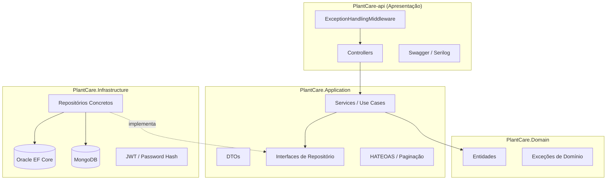

# PlantCare API

Backend em **ASP.NET Core 8** para gerenciamento e monitoramento de plantas, consolidando as entregas das Sprints 1, 2 e 3 com arquitetura em camadas, API RESTful completa, persistência relacional (Oracle) e NoSQL (MongoDB), observabilidade e testes automatizados.

## Integrantes

| Nome Completo | RM |
|---------------|-----|
| João Victor Alves da Silva | 559726 |
| Vinicius Kenzo Tocuyosi | 559982 |
| Juan Pablo Rebelo Coelho | 560445 |

---

## Arquitetura

A solução segue **Clean Architecture** com separação clara de responsabilidades:



### Projetos da solução

| Projeto | Responsabilidade |
|---------|------------------|
| `PlantCare.Domain` | Entidades e regras de domínio puras |
| `PlantCare.Application` | Casos de uso, DTOs, interfaces, HATEOAS |
| `PlantCare.Infrastructure` | EF Core Oracle, MongoDB, JWT, repositórios |
| `PlantCare-api` | Controllers, middleware, configuração HTTP |
| `PlantCare-api.Tests.Unit` | Testes unitários (Domínio + Aplicação) |
| `PlantCare-api.Tests.Integration` | Testes de integração HTTP |

### Princípios aplicados

- **SOLID**: interfaces para repositórios e serviços; injeção de dependência em todas as camadas
- **DIP**: Application define contratos; Infrastructure implementa
- **SRP**: controllers finos; regras de negócio nos services
- **Tratamento global de exceções**: `ExceptionHandlingMiddleware` retorna `ProblemDetails` JSON

---

## Tecnologias

- ASP.NET Core 8, Entity Framework Core + Oracle
- MongoDB Driver (registros de cuidado)
- JWT Bearer Authentication
- Serilog (logging estruturado)
- Application Insights (opcional)
- Health Checks (Oracle + MongoDB)
- xUnit + Moq + WebApplicationFactory

---

## Pré-requisitos

- [.NET 8 SDK](https://dotnet.microsoft.com/download)
- Oracle Database (connection string FIAP ou local)
- MongoDB (local ou Atlas) para registros de cuidado
- (Opcional) Application Insights Connection String

---

## Configuração

Edite `PlantCare-api/appsettings.json`:

```json
{
  "ConnectionStrings": {
    "DefaultConnection": "Data Source=...;User Id=...;Password=...;"
  },
  "MongoDb": {
    "ConnectionString": "mongodb://localhost:27017",
    "DatabaseName": "PlantCareDb"
  },
  "Jwt": {
    "Key": "sua_chave_secreta_com_pelo_menos_32_caracteres",
    "Issuer": "PlantCareAPI",
    "Audience": "PlantCareAPI"
  }
}
```

### Migrações EF Core (Oracle)

```bash
cd PlantCare.Infrastructure
dotnet ef database update --startup-project ../PlantCare-api
```

---

## Como executar

```bash
cd PlantCare-api
dotnet run
```

- Swagger UI: `https://localhost:{porta}/swagger`
- Health Check: `GET /health`

---

## Autenticação JWT

1. Cadastre um usuário: `POST /api/usuario`
2. Faça login: `POST /api/auth/login` com `{ "email", "senha" }`
3. Use o token retornado: `Authorization: Bearer {token}`
4. Endpoints de plantas e registros de cuidado exigem autenticação

---

## Endpoints da API

### Monitoramento

| Método | Rota | Descrição | Auth |
|--------|------|-----------|------|
| GET | `/health` | Saúde Oracle + MongoDB | Não |

### Autenticação e Usuários

| Método | Rota | Descrição | Auth |
|--------|------|-----------|------|
| POST | `/api/usuario` | Cadastrar usuário (senha com hash) | Não |
| POST | `/api/auth/login` | Obter token JWT | Não |

### Plantas (HATEOAS + Paginação)

| Método | Rota | Descrição | Auth |
|--------|------|-----------|------|
| GET | `/api/planta` | Listar com paginação, ordenação e filtros | Sim |
| GET | `/api/planta/{id}` | Detalhe com links HATEOAS | Sim |
| POST | `/api/planta` | Criar planta | Sim |
| PUT | `/api/planta/{id}` | Atualizar planta | Sim |
| DELETE | `/api/planta/{id}` | Remover planta | Sim |

**Query parameters** (`GET /api/planta`):

| Parâmetro | Descrição | Padrão |
|-----------|-----------|--------|
| `page` | Página atual | 1 |
| `pageSize` | Itens por página (máx. 50) | 10 |
| `sortBy` | `id`, `nome`, `especie`, `status`, `datacadastro` | id |
| `sortDirection` | `asc` ou `desc` | asc |
| `nome` | Filtro parcial por nome | - |
| `especie` | Filtro parcial por espécie | - |
| `status` | Filtro exato por status | - |
| `usuarioId` | Filtro por usuário | - |

**Exemplo de resposta paginada com HATEOAS:**

```json
{
  "data": [ { "id": 1, "nome": "Samambaia", "...": "..." } ],
  "pagination": {
    "page": 1,
    "pageSize": 10,
    "totalItems": 25,
    "totalPages": 3,
    "hasPrevious": false,
    "hasNext": true
  },
  "links": [
    { "rel": "self", "href": "https://localhost:5001/api/planta?page=1&pageSize=10", "method": "GET" },
    { "rel": "next", "href": "https://localhost:5001/api/planta?page=2&pageSize=10", "method": "GET" }
  ]
}
```

### Registros de Cuidado (MongoDB)

| Método | Rota | Descrição | Auth |
|--------|------|-----------|------|
| POST | `/api/registroscuidado` | Registrar cuidado (rega, poda, etc.) | Sim |
| GET | `/api/registroscuidado/planta/{plantaId}` | Listar registros de uma planta | Sim |

---

## Testes

```bash
dotnet test
```

| Projeto | Cobertura |
|---------|-----------|
| `PlantCare-api.Tests.Unit` | Domínio (`Planta`) e Aplicação (`PlantaService`, `UsuarioService`) |
| `PlantCare-api.Tests.Integration` | Controllers HTTP com JWT e mocks |

Padrão **AAA** (Arrange, Act, Assert) em todos os testes.

---

## Observabilidade

- **Serilog**: logs estruturados no console com enrich de contexto
- **Health Checks**: `/health` verifica Oracle e MongoDB
- **Application Insights**: ativado quando `ApplicationInsights:ConnectionString` está configurado

---

## Documentação OpenAPI

A especificação completa está disponível em `/swagger/v1/swagger.json` com autenticação Bearer configurada. Use o Swagger UI para testar os endpoints interativamente.

---

## Estrutura de pastas

```
PlantCareAPI/
├── PlantCare.Domain/
├── PlantCare.Application/
├── PlantCare.Infrastructure/
├── PlantCare-api/
├── PlantCare-api.Tests.Unit/
├── PlantCare-api.Tests.Integration/
└── readme.md
```
